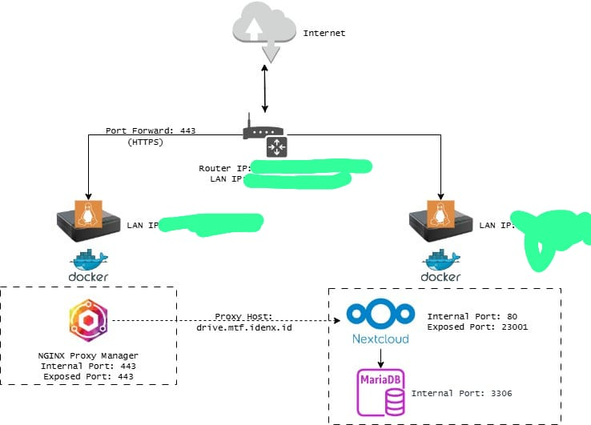
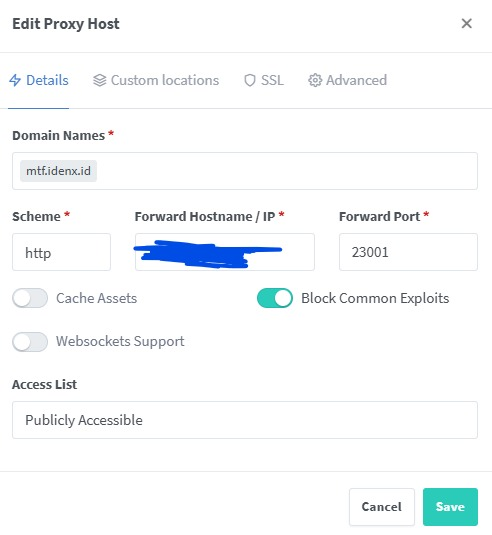
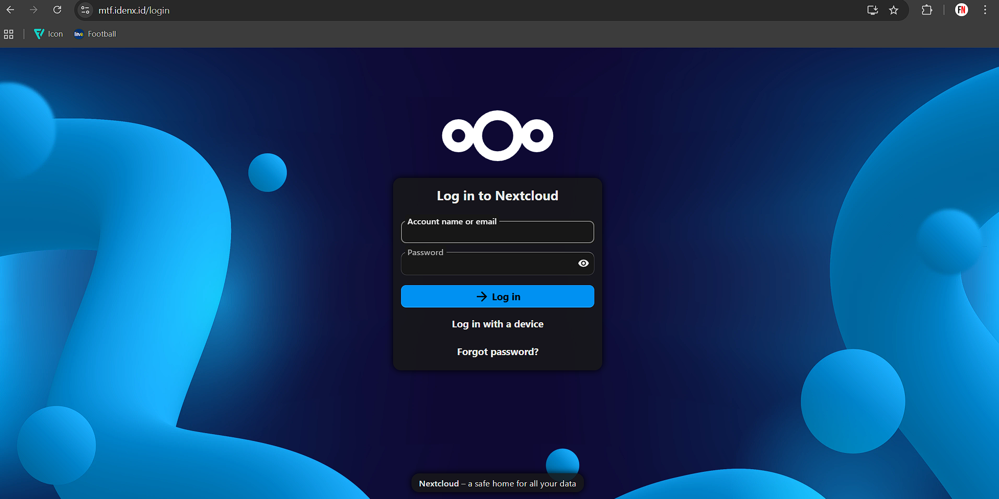
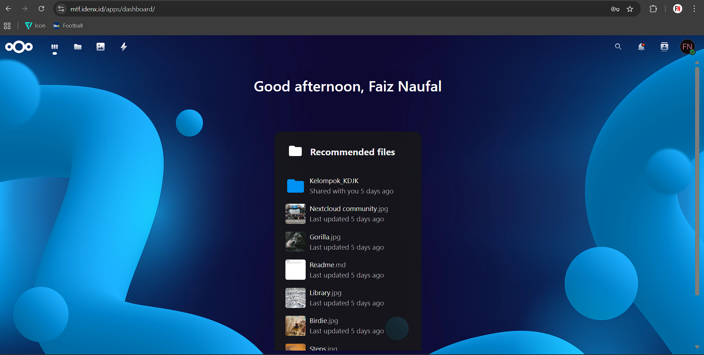
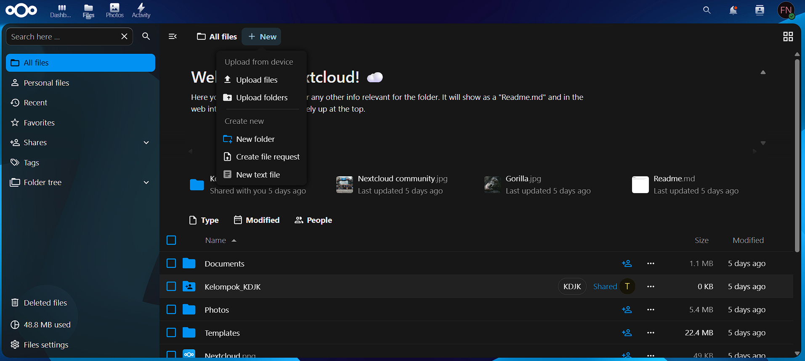
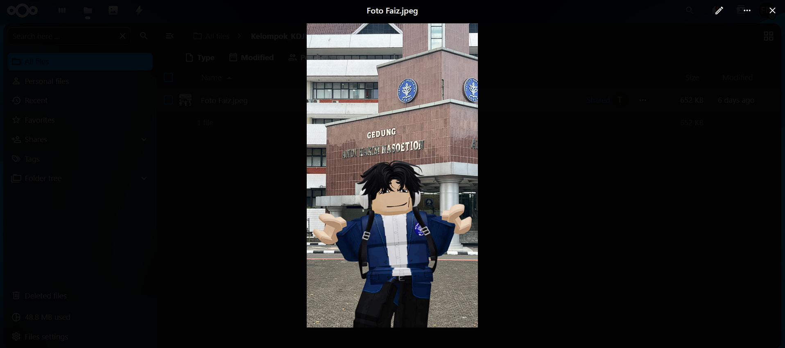
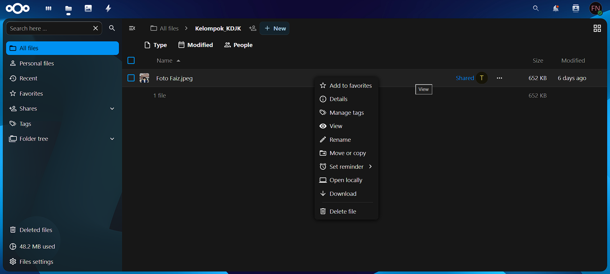
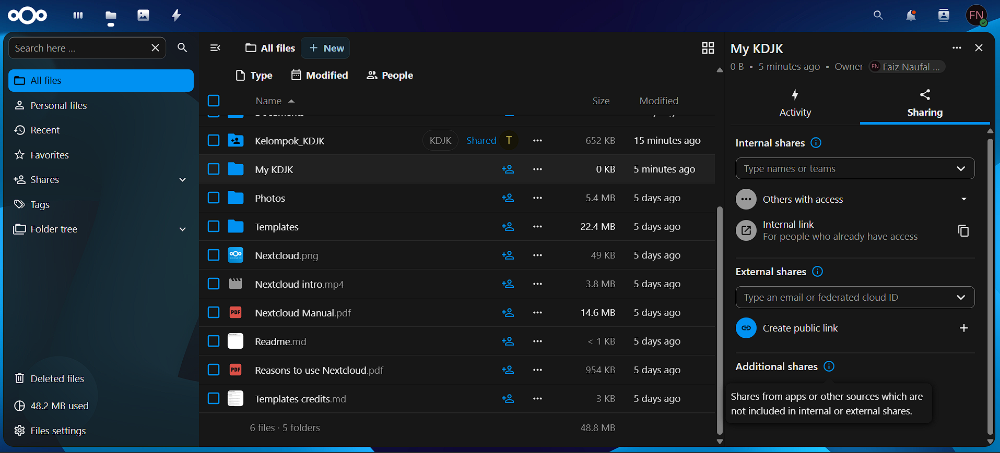

<div align="center">
  

# Nextcloud: Sistem Kolaborasi dan Penyimpanan Data Self-Hosted

*Implementasi Self-Hosted Cloud Storage dan Sistem Kolaborasi Berbasis Docker*

</div>

<a id="toc"></a>

## Daftar Isi

| [Sekilas Tentang](#abstrak) | [Instalasi](#instalasi--konfigurasi) | [Konfigurasi](#4-konfigurasi-reverse-proxy-via-web-gui) | [Keamanan](#keamanan--backup) | [Cara Pemakaian](#penggunaan-nextcloud) | [Pembahasan](#pembahasan) | [Referensi](#referensi) |

## Abstrak

[⬆️ Kembali ke atas](#daftar-isi)

Dokumen ini menjelaskan implementasi Nextcloud sebagai sistem kolaborasi dan penyimpanan data self-hosted. Implementasi dilakukan pada lingkungan Mini-PC berbasis Ubuntu 22.04 dengan penggunaan Docker, Docker Compose, Nginx Proxy Manager, dan MariaDB. Tujuan pekerjaan ini adalah menyediakan panduan teknis lengkap yang mencakup instalasi, konfigurasi, keamanan, backup, serta pengujian performa awal.

---

## Latar Belakang dan Tujuan

[⬆️ Kembali ke atas](#daftar-isi)

Kebutuhan organisasi/akademik terhadap sistem penyimpanan dan kolaborasi data yang aman, dapat dikendalikan, dan hemat biaya mendorong penggunaan solusi self-hosted. Nextcloud dipilih karena fitur kolaborasi (file sharing, calendar, talk, docs), fleksibilitas deployment, dan dukungan ekosistem aplikasi. Tujuan laporan ini adalah:

* Mendesain dan mengimplementasikan Nextcloud self-hosted pada Mini-PC.
* Menyusun dokumentasi teknis yang dapat direplikasi.
* Melakukan pengujian performa dasar dan menyiapkan prosedur backup dan hardening.

---

## Ruang Lingkup dan Batasan

[⬆️ Kembali ke atas](#daftar-isi)

Ruang lingkup:

* Instalasi menggunakan Docker Compose.
* Konfigurasi reverse proxy via Nginx Proxy Manager.
* Pengaturan SSL via Let's Encrypt.
* Backup otomatis sederhana untuk data dan database.

Batasan:

* Pengujian menggunakan skenario kecil (≤ 50 pengguna aktif simultan).
* Tidak memasukkan integrasi enterprise storage (NAS/S3) secara lengkap.
* Evaluasi keamanan fokus pada best-practice dasar (update, SSL).

---

## Tinjauan Pustaka Singkat

[⬆️ Kembali ke atas](#daftar-isi)

* Prinsip containerization dan orkestrasi ringan dengan Docker.
* Arsitektur reverse proxy untuk mengamankan dan memetakan domain.
* Mekanisme penyimpanan Nextcloud (data directory) dan peran DBMS (MariaDB).

---

## Arsitektur Sistem

[⬆️ Kembali ke atas](#daftar-isi)

Sistem diimplementasikan pada Mini-PC dengan topologi sederhana:

* Host: Mini-PC (Ubuntu 22.04)
* Reverse Proxy: Nginx Proxy Manager (container terpisah; mengelola TLS/SSL dan virtual host)
* Aplikasi: Nextcloud (container)
* Database: MariaDB (container)
* Network: user-defined Docker network (`jeff`)



---

## Teknologi yang Digunakan

[⬆️ Kembali ke atas](#daftar-isi)

* Ubuntu 22.04 (host)
* Docker & Docker Compose (v3.8)
* Nextcloud (image resmi)
* MariaDB (image resmi)
* Nginx Proxy Manager (opsional, pada host atau container terpisah)
* Certbot / Let's Encrypt untuk TLS

---

## Instalasi & Konfigurasi

[⬆️ Kembali ke atas](#daftar-isi)

### 1. Persiapan Host

1. Update sistem:

```bash
sudo apt update && sudo apt upgrade -y
```

2. Pasang Docker & Docker Compose (ikuti panduan resmi Docker untuk Ubuntu 22.04).
3. Pastikan port 80 terbuka untuk Nginx Proxy Manager/Let's Encrypt.

### 2. Struktur Repository

Direktori contoh:

```
nextcloud/
├─ docker-compose.yml
├─ config/
│  └─ config.php (opsional, diisi setelah instalasi awal)
├─ data/
└─ backup/
```

### 3. Contoh `docker-compose.yml`

File lengkap tersedia di `docker-compose.yml`. Secara ringkas:

* Service `db` untuk MariaDB
* Service `app` untuk Nextcloud (menggunakan image resmi)
* Volumes host-mounted agar data persisten
* Network `jeff` untuk isolasi

### 4. Konfigurasi Reverse Proxy via Web GUI

Setelah container **Nginx Proxy Manager** dijalankan, antarmuka administrasi dapat diakses melalui browser dengan alamat:

```
http://<IP-server>:81
```

Contoh:
`http://192.168.1.10:81`

#### 1. Login Awal

Gunakan kredensial bawaan berikut:

* **Email:** `admin@example.com`
* **Password:** `changeme`

Segera ubah password setelah login pertama untuk alasan keamanan.

#### 2. Menambahkan Proxy Host

Masuk ke tab **“Proxy Hosts”** dan pilih **Add Proxy Host**, lalu isi kolom berikut:

| Kolom                     | Nilai Contoh     | Keterangan                                       |
| ------------------------- | ---------------- | ------------------------------------------------ |
| **Domain Names**          | `mtf.idenx.id`   | Domain publik untuk akses Nextcloud              |
| **Scheme**                | `http`           | Gunakan HTTP karena SSL belum diaktifkan         |
| **Forward Hostname / IP** | `IP-server`      | Nama container Nextcloud                         |
| **Forward Port**          | `23001`          | Port container Nextcloud                         |
| **Cache Assets**          | Kosong           | Untuk efisiensi akses statis                     |
| **Block Common Exploits** | Centang          | Perlindungan dasar terhadap serangan umum        |

#### 3. Verifikasi Akses

Buka browser dan kunjungi:

```
http://mtf.idenx.id
```

Jika konfigurasi berhasil, halaman login Nextcloud akan muncul.
Apabila domain belum resolve ke IP server, pastikan pengaturan DNS dan port forwarding router telah sesuai (port 80 diarahkan ke server host).

#### 4. Tampilan Dashboard

Antarmuka NPM berbentuk web modern yang menampilkan daftar **Proxy Host**, **SSL Certificates**, dan **Access Lists**.
Contohnya seperti berikut:



---

## Penggunaan Nextcloud

[⬆️ Kembali ke atas](#daftar-isi)

Setelah instalasi dan konfigurasi selesai, Nextcloud dapat diakses melalui browser di alamat domain yang sudah dikonfigurasi, misalnya:

```
http://mtf.idenx.id
```

Berikut panduan penggunaan untuk pengguna umum:

### 1. Login ke Nextcloud

* Buka browser dan akses domain Nextcloud.

* Masukkan **username** dan **password** yang telah dibuat saat instalasi.
* Setelah login, pengguna akan masuk ke tampilan beranda (dashboard) Nextcloud.

* Klik icon berbentuk folder di pojok atas kiri bernama "Files".


### 2. Mengunggah (Upload) File

* Klik ikon **➕ New** di atas area file.

* Pilih file dari komputer yang ingin diunggah.
* File akan tersimpan di folder utama pengguna dan dapat diakses kapan saja.


### 3. Mengunduh (Download) File

* Klik kanan pada file yang ingin diunduh, lalu pilih **Download**.

* File akan otomatis tersimpan di perangkat lokal pengguna.

### 4. Membuat Folder Baru

* Klik ikon **➕ New** di atas area file.
[New Nextcloud](docs/nc-new.png)
* Beri nama folder sesuai kebutuhan.
[Folder Nextcloud](docs/nc-folder.png)
* Folder ini bisa diisi file pribadi atau dibagikan dengan pengguna lain.


### 5. Berbagi File atau Folder

* Klik ikon **Share (bagikan)** di samping file/folder.
* Pilih **Create public link** untuk membagikan kepada publik, atau **Internal shares** untuk membatasi akses hanya ke pengguna tertentu.


### 6. Sinkronisasi dengan Aplikasi Desktop dan Mobile

* Unduh aplikasi Nextcloud Desktop (Windows, macOS, Linux) atau Mobile (Android, iOS) dari [https://nextcloud.com/install](https://nextcloud.com/install).
* Masukkan URL server (misal `http://mtf.idenx.id`) dan login dengan akun Nextcloud kamu.
[Folder Nextcloud](docs/nc-mobile.png)
* Aplikasi akan otomatis menyinkronkan file antara perangkat dan server.

---

## Keamanan & Backup

[⬆️ Kembali ke atas](#daftar-isi)

### Keamanan Dasar

* Aktifkan TLS (HTTPS) dengan Let's Encrypt melalui Nginx Proxy Manager.
* Selalu perbarui image Docker dan host OS.
* Konfigurasi file permission: data directory harus milik www-data pada container Nextcloud.

---

## Pembahasan

### Pendapat Tentang Aplikasi Web Ini

Nextcloud merupakan aplikasi web self-hosted yang sangat fleksibel dan mudah digunakan untuk kebutuhan kolaborasi data. Bagi pengguna umum, tampilannya mirip layanan cloud populer seperti Google Drive, tetapi dengan keunggulan utama: data sepenuhnya dikelola sendiri di server lokal. Integrasi dengan aplikasi tambahan seperti Talk, Calendar, dan OnlyOffice memberikan pengalaman kolaborasi yang lengkap tanpa bergantung pada pihak ketiga.

### Kelebihan

* **Kendali penuh atas data:** semua file tersimpan di server sendiri.
* **Open source dan gratis:** tanpa biaya lisensi.
* **Fitur kolaborasi lengkap:** sinkronisasi lintas perangkat, berbagi file, chat, dan kolaborasi dokumen.
* **Ekstensi fleksibel:** dapat menambahkan aplikasi tambahan sesuai kebutuhan.
* **Kompatibilitas luas:** berjalan di hampir semua platform (Linux, Windows, macOS, Android, iOS).

### Kekurangan

* **Butuh pengetahuan teknis awal:** instalasi dan maintenance memerlukan dasar Docker dan server.
* **Kinerja bergantung pada hardware:** pada Mini-PC atau server kecil, performa bisa menurun dengan banyak pengguna.
* **Tidak sepraktis cloud komersial:** butuh pengaturan manual untuk SSL, backup, dan DNS.

### Perbandingan dengan Aplikasi Sejenis

| Aplikasi         | Hosting              | Biaya           | Fitur Kolaborasi | Privasi Data                   | Tingkat Kustomisasi |
| ---------------- | -------------------- | --------------- | ---------------- | ------------------------------ | ------------------- |
| **Nextcloud**    | Self-hosted          | Gratis          | Lengkap          | Sangat tinggi                  | Sangat tinggi       |
| **Google Drive** | Cloud (Google)       | Freemium        | Lengkap          | Rendah (data di server Google) | Rendah              |
| **Dropbox**      | Cloud (Dropbox Inc.) | Berbayar        | Dasar            | Sedang                         | Rendah              |
| **Seafile**      | Self-hosted          | Gratis/Berbayar | Lengkap          | Tinggi                         | Tinggi              |
| **OwnCloud**     | Self-hosted          | Gratis          | Mirip Nextcloud  | Tinggi                         | Tinggi              |

Secara keseluruhan, Nextcloud lebih cocok untuk pengguna atau institusi yang membutuhkan **kontrol penuh atas data**, privasi tinggi, dan kemampuan integrasi fleksibel, sementara layanan cloud komersial lebih unggul untuk pengguna umum yang menginginkan kemudahan tanpa setup teknis.

---

## Kesimpulan & Saran

[⬆️ Kembali ke atas](#daftar-isi)

* Nextcloud cocok untuk kebutuhan kampus skala kecil sampai menengah dengan kontrol penuh atas data.
* Rekomendasi: gunakan SSD untuk data directory, atur backup otomatis, dan pantau resource secara periodik.
* Pengembangan lanjutan: integrasi OnlyOffice/Collabora untuk editing dokumen real-time, dan konfigurasi clustering untuk high-availability.

---

## Lampiran

[⬆️ Kembali ke atas](#daftar-isi)

* `docker-compose.yml` — konfigurasi service
* `diagram-arsitektur.jpg` — diagram topologi

---

## Referensi

[⬆️ Kembali ke atas](#daftar-isi)

* Dokumentasi resmi Nextcloud: [https://nextcloud.com](https://nextcloud.com)
* Dokumentasi Docker: [https://docs.docker.com](https://docs.docker.com)
